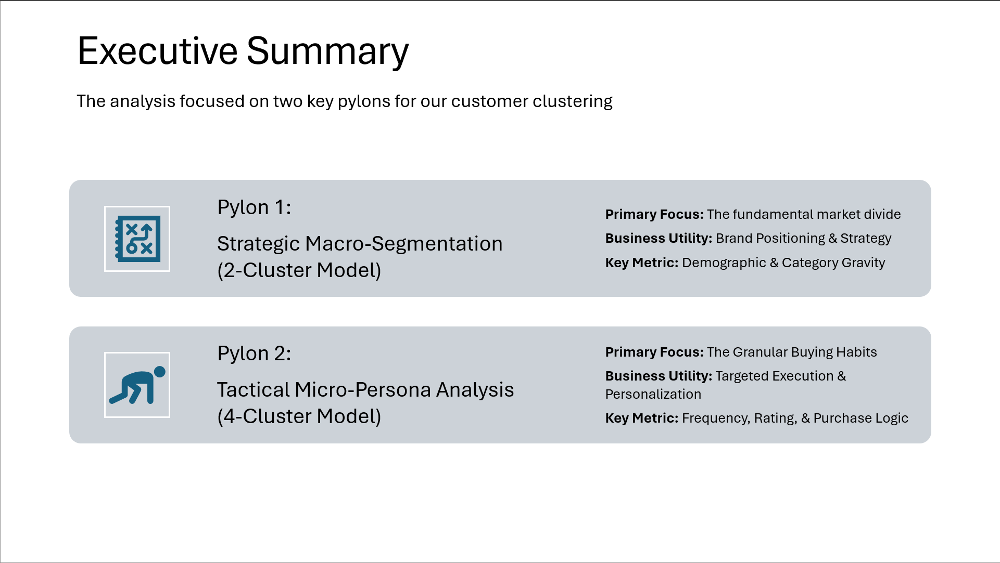
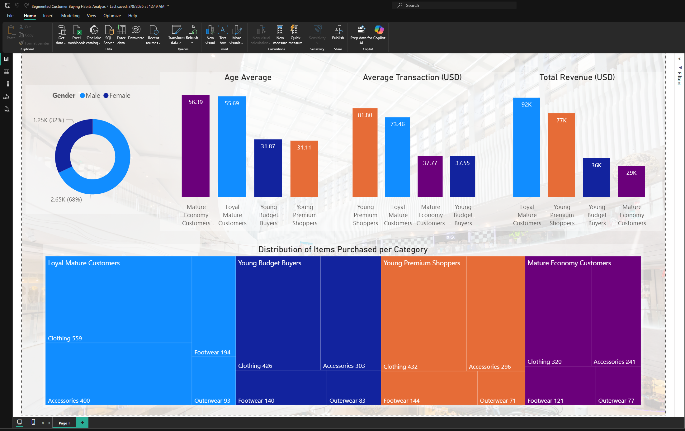

# Segmented Customer Buying Habits Analysis

This project implements a comprehensive customer segmentation strategy using Machine Learning to uncover patterns in purchasing behavior. The workflow transitions from a strategic macro-segmentation (2-Cluster Model) to a tactical micro-persona analysis (4-Cluster Model).

The project was conducted by Thanos Chronopoulos, Andreas Gabriel & Filippos Georgiopoulos.

## Notebook Chapters

1. Strategic Macro-Segmentation (2-Cluster Model)

    Data Preparation: Cleaning and preprocessing of the shopping_trends.csv dataset, including One-Hot Encoding for categorical variables and feature scaling.

    Clustering: Utilizing the K-Means algorithm to identify two primary groups: the "Mass Market" and the "Footwear Specialist."

    Interpretability: Employing SHAP values and a Random Forest Classifier to determine the key drivers that differentiate the segments.

2. Tactical Micro-Persona Analysis (4-Cluster Model)

    Advanced Clustering: Applying Agglomerative Hierarchical Clustering and using dendrograms to determine the optimal number of sub-segments.

    Deep Dive: "Shattering" the large customer blocks into 4 distinct personas to identify "High-Value VIPs" hidden within the broader groups.

    Evaluation: Using the Silhouette Visualizer to verify the cohesion and separation of the refined clusters.

## Key Findings & Business Impact

    Segment 0 (The Footwear Specialist): A niche group defined almost exclusively by a specific focus on Footwear.

    Segment 1 (Mass Market): A high-volume, gender-neutral cluster primarily interested in Clothing and Accessories.

    Strategic Pivot: Recommendation for differentiated campaigns: broad-reach for the Mass Market and highly targeted tracks for the Specialists.

## Project Assets

    Segmented Customer Buying Habits Analysis.pptx: A full presentation showcasing findings, data visualizations, and strategic business recommendations.

    Jupyter Notebooks: Step-by-step code execution from Exploratory Data Analysis (EDA) to final model validation.

    Power BI Dashboard: A supplemental interactive dashboard (mentioned in the presentation) for dynamic data exploration.

## Technologies Used

    Data Science Stack: pandas, numpy, scikit-learn, scipy

    Visualization: seaborn, matplotlib, yellowbrick

    Explainable AI: SHAP (for feature importance and cluster drivers)